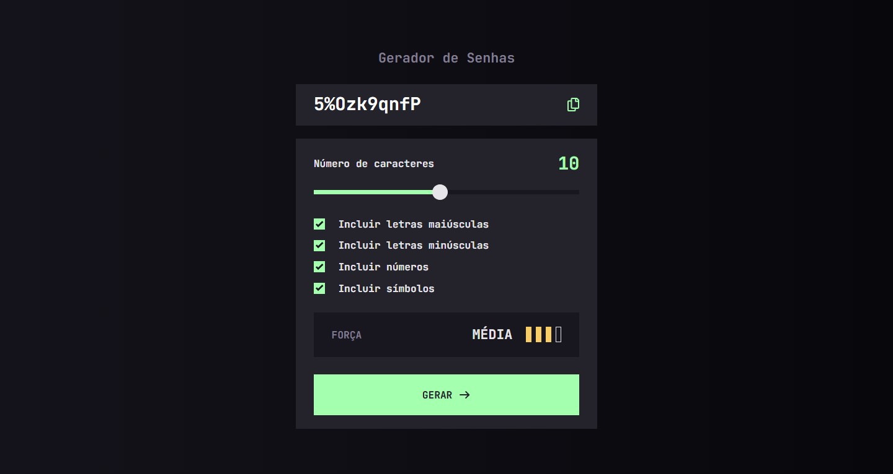

# Frontend Mentor - Password generator app solution

This is a solution to the [Password generator app challenge on Frontend Mentor](https://www.frontendmentor.io/challenges/password-generator-app-Mr8CLycqjh).

## Table of contents

- [Overview](#overview)
  - [The challenge](#the-challenge)
  - [Screenshot](#screenshot)
  - [Links](#links)
- [My process](#my-process)
  - [Built with](#built-with)
  - [What I learned](#what-i-learned)
  - [AI Collaboration](#ai-collaboration)
- [Author](#author)

## Overview

### The challenge

Users should be able to:

- Generate a password based on selected checkboxes.
- Copy the password with an on-screen "Copied" confirmation.
- View a visual strength rating using colored meter bars.
- Experience a fully responsive layout with optimal hover/focus states.

### Screenshot

### Links

- Solution URL: [GitHub Repository](https://github.com/mnyellison/password-generator-app)
- Live Site URL: [Vercel Deploy](https://password-generator-eight-dun-61.vercel.app/)

## My process

### Built with

- Semantic HTML5 markup
- CSS Custom Properties & Flexbox/Grid
- Mobile-first workflow
- Vanilla JavaScript (ES6+)

### What I learned

Key takeaways from this project:

- **Single Responsibility Principle (SRP):** Refactored monolithic code into clean, modular JavaScript functions.
- **Fluid Responsiveness:** Implemented a smooth `margin-right` using `clamp()` that caps precisely at `768px`.
- **UI States:** Managed dynamic CSS classes for the strength meter and added a timed `setTimeout` for clipboard feedback.
- **Accessibility:** Switched from `:focus` to `:focus-visible` to deliver a cleaner interface for mouse users while keeping keyboard navigation accessible.

### AI Collaboration

- Used Gemini to review code structure and brainstorm optimization logic.
- Focused on renaming abstract variables (like changing `pool` to `allowedCharacters`) and breaking down complex functions into smaller, single-purpose blocks.

## Author

- Frontend Mentor - [@mnyellison](https://www.frontendmentor.io/profile/mnyellison)
